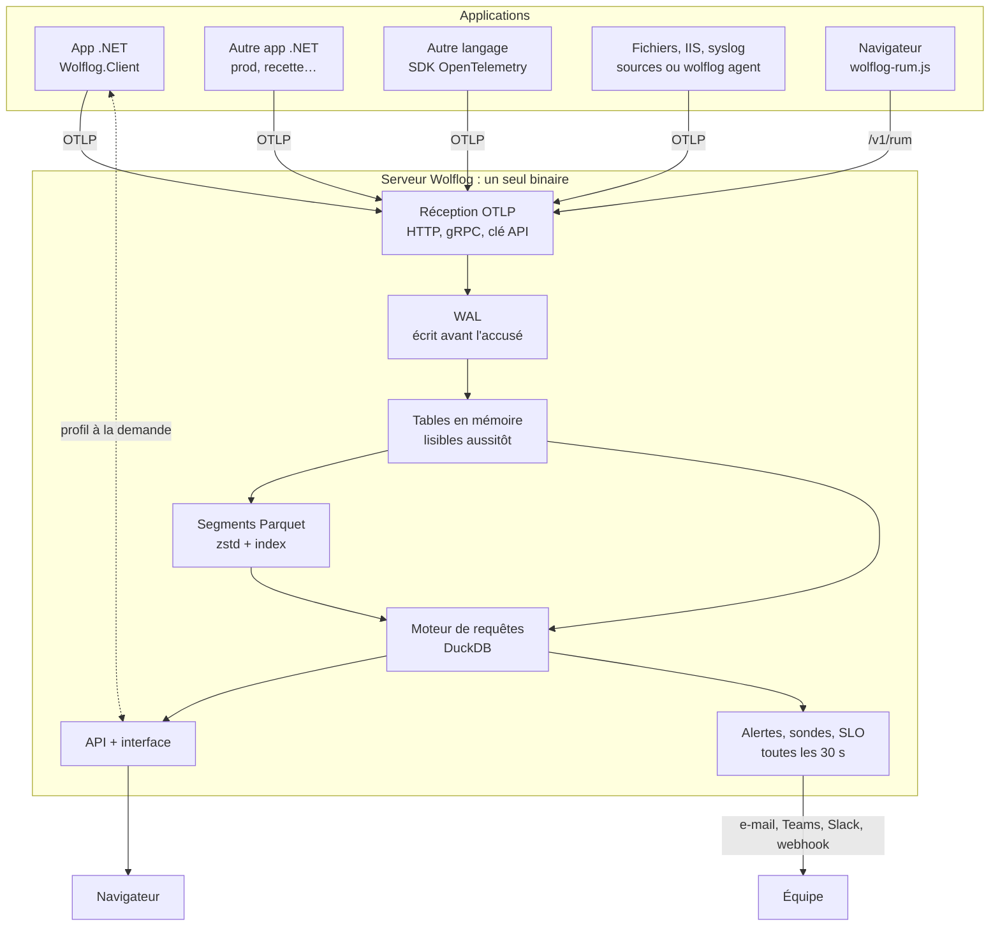

<p align="center"></p>

# Wolflog

Logs, traces, métriques et crashs de vos applications .NET dans un seul serveur, installé en une commande.
Wolflog remplace la combinaison OpenTelemetry Collector + Loki + Tempo + Prometheus + Grafana.

- **Un binaire** : réception OTLP, stockage, requêtes et interface web embarqués. Aucune base de données à installer.
- **Compatible OpenTelemetry** : OTLP/HTTP (protobuf ou JSON) et OTLP/gRPC. N'importe quel langage peut envoyer ses données.
- **Lib .NET** : `builder.AddWolflog();`. Reprend les logs `ILogger` et Serilog, trace ASP.NET Core et HttpClient, collecte les métriques runtime.
- **Crashs** : exceptions non gérées capturées sur disque avant l'arrêt du processus, arrêts brutaux (StackOverflow, kill, recyclage IIS) détectés au redémarrage suivant, avec les derniers logs émis.
- **Tableaux de bord personnalisables** : autant que nécessaire, panneaux au choix (requêtes HTTP, métriques, logs, erreurs, chiffres clés), réorganisables par glisser-déposer.
- **Contenu HTTP** : en-têtes et corps des requêtes reçues et des appels HttpClient, secrets masqués.
- **Plusieurs applications et environnements** dans la même interface (filtres service et environnement).
- **Surveillance** : alertes (taux d'erreur, latence, nouvelle erreur, service muet, requête libre, sondes, SLO, santé de Wolflog)
  envoyées par e-mail, Microsoft Teams, Slack ou webhook ; sondes de disponibilité HTTP/TCP ; objectifs de service et budget d'erreur.
- **Au quotidien** : statut des erreurs (à traiter, résolue, ignorée, réapparue, assignée), déploiements marqués sur les graphiques,
  recherches enregistrées, export CSV/JSON, carte des services, variables de tableau de bord, exemplars (d'une métrique à la trace).
- **Au-delà de .NET** : fichiers de logs (texte, JSON, IIS, Docker, Kubernetes), syslog, mode agent, suivi navigateur (erreurs JS, Web Vitals).
- **Profilage** CPU et mémoire à la demande, en un clic, affiché en graphe en flammes.
- **Comptes et rôles** (lecteur, éditeur, administrateur), connexion unique OpenID Connect (Entra ID, Keycloak, Google), clés API par application.
- **Rapide** : écriture en colonnes (Parquet + zstd), requêtes vectorisées (DuckDB embarqué), segments ignorés sans lecture grâce à des index (plage de temps, services, trigrammes du texte, filtre de Bloom des trace_id).

---

## 1. Installer le serveur

Téléchargez l'archive correspondant au serveur (voir [Construire les livrables](#5-construire-les-livrables)).

### Linux (systemd)

```bash
tar xzf wolflog-linux-x64.tar.gz && cd wolflog-linux-x64
sudo bash install.sh              # options : --port 5080 --data /var/lib/wolflog
```

Le script copie le binaire dans `/opt/wolflog`, crée l'utilisateur système `wolflog` et le service `wolflog.service`, puis affiche l'adresse, le mot de passe administrateur et la clé API.
Relancer le script avec une nouvelle version met à jour l'installation en conservant la configuration et les données.

### Windows : IIS

Prérequis : IIS et le module ASP.NET Core (Hosting Bundle .NET 10). Le script peut installer les deux.

```powershell
Expand-Archive wolflog-win-x64.zip C:\temp\wolflog ; cd C:\temp\wolflog
.\install-iis.ps1                                   # site "Wolflog" sur le port 5080
.\install-iis.ps1 -Port 8080 -HostName wolflog.mondomaine.fr
.\install-iis.ps1 -EnableIis -InstallHostingBundle  # serveur vierge
```

Le pool d'applications est configuré pour Wolflog : toujours démarré, pas d'arrêt pour inactivité, pas de recyclage périodique ni de recyclage avec chevauchement. Les données sont dans `C:\ProgramData\Wolflog`.
Sous IIS, l'OTLP passe par HTTP sur le port du site. Le gRPC (port 4317) n'est disponible qu'en service.

### Windows : service

Copiez le dossier à son emplacement définitif (par exemple `C:\Program Files\Wolflog`), puis dans une console administrateur :

```powershell
.\wolflog.exe install --port 5080 --open-firewall
```

### Docker

```bash
docker build -t wolflog .
docker run -d --name wolflog -p 5080:5080 -p 4317:4317 -p 4318:4318 -v wolflog-data:/data wolflog
docker logs wolflog        # identifiants générés au premier démarrage
```

Ou `docker compose -f deploy/docker/docker-compose.yml up -d`.

### Commandes utiles

| Commande | Effet |
|---|---|
| `wolflog credentials` | Affiche l'utilisateur, le mot de passe et la clé API |
| `wolflog install` / `wolflog uninstall` | Installe ou retire le service (les données restent) |
| `wolflog init --data <dir>` | Génère `wolflog.json` sans installer de service |
| `wolflog healthcheck` | Code de sortie 0 si le serveur local répond |
| `wolflog reset-password [user]` | Nouveau mot de passe provisoire (défaut : admin) |
| `wolflog backup <fichier.zip> [--config-only]` | Sauvegarde configuration et données (serveur démarré ou non) |
| `wolflog restore <fichier.zip>` | Restaure une sauvegarde (serveur arrêté) |
| `wolflog agent …` | Lit des fichiers de logs sur une autre machine et les envoie à Wolflog (voir « Autres sources ») |

---

## 2. Connecter une application .NET

```bash
dotnet add package Wolflog.Client
dotnet add package Wolflog.Client.Serilog   # seulement si vous utilisez Serilog
```

`appsettings.json` :

```json
"Wolflog": {
  "Endpoint": "http://wolflog.mondomaine.fr:5080",
  "ApiKey": "la clé affichée à l'installation"
}
```

`Program.cs` :

```csharp
var builder = WebApplication.CreateBuilder(args);
builder.AddWolflog();
```

Cela suffit pour recevoir :

- les logs `ILogger` avec leurs propriétés structurées, les scopes et le `trace_id` ;
- les traces des requêtes entrantes (ASP.NET Core) et sortantes (HttpClient), de Npgsql, MySqlConnector, Azure SDK, MassTransit, et de vos propres `ActivitySource` dont le nom commence comme votre application ;
- les métriques ASP.NET Core, HttpClient et runtime .NET (GC, threads, exceptions), et vos propres `Meter` ;
- les crashs.

### Serilog

Ajoutez `.WriteTo.Wolflog()` à votre configuration existante :

```csharp
builder.AddWolflog();
builder.Services.AddSerilog((services, log) => log
    .ReadFrom.Configuration(builder.Configuration)
    .WriteTo.Console()
    .WriteTo.Wolflog(services));
```

Si vous créez `Log.Logger` avant l'hôte (logger de démarrage), `.WriteTo.Wolflog()` sans argument fonctionne aussi. Les événements émis avant le démarrage sont conservés puis envoyés.

### Options

Toutes les options se règlent dans la section `Wolflog` ou dans `AddWolflog(o => …)` :

| Option | Défaut | Rôle |
|---|---|---|
| `Enabled` | `true` | Désactive tout l'envoi, par exemple en développement |
| `ServiceName` / `ServiceVersion` / `Environment` | nom et version de l'application, `IHostEnvironment` | Identité du service |
| `Logs` / `Traces` / `Metrics` / `Crashes` | `true` | Active chaque type de donnée |
| `TraceSampleRatio` | `1.0` | Échantillonnage des traces |
| `MinimumLevel` | règles `Logging:LogLevel` | Niveau minimum envoyé |
| `ActivitySources` / `Meters` | | Sources supplémentaires, jokers acceptés (`MaSociete.*`) |
| `IgnoredPaths` | `/health`, `/healthz`… | Requêtes non tracées |
| `BufferDirectory` / `MaxBufferSizeMb` | `%TEMP%/wolflog/<service>`, 200 | Tampon disque utilisé quand le serveur est injoignable |
| `ConfigureTracing` / `ConfigureMetrics` | | Accès direct au SDK OpenTelemetry, par exemple `t => t.AddEntityFrameworkCoreInstrumentation()` |

### Fonctionnement côté application

- Les envois sont groupés toutes les 2 s, compressés en gzip et authentifiés par la clé API.
- **Serveur injoignable** : les lots sont écrits dans le tampon disque et renvoyés dans l'ordre dès que le serveur répond. Les files d'attente en mémoire sont bornées : l'application n'est jamais ralentie ni bloquée.
- **Crash** : en cas d'exception non gérée, le rapport est écrit sur disque de façon synchrone avec les 40 derniers logs, puis envoyé immédiatement si possible, sinon au démarrage suivant.
- **Arrêt brutal** : StackOverflow, OutOfMemory, `kill -9` ou recyclage IIS forcé ne laissent aucune chance au code .NET. Wolflog le détecte au démarrage suivant grâce au marqueur de session et le signale comme crash `Wolflog.AbnormalTermination`, avec les derniers logs connus.

### Contenu des requêtes HTTP

Les en-têtes et corps des requêtes reçues (ASP.NET Core) et des appels sortants (HttpClient) sont attachés aux traces
et visibles dans **Requêtes HTTP** et dans le détail d'un span.

```json
"Wolflog": {
  "Http": {
    "Bodies": "Errors",          // Off | Errors (défaut : requêtes en échec uniquement) | All
    "Headers": true,
    "MaxBodyBytes": 16384,
    "RedactedFields": [ "numeroSecu" ],  // ajoutés à la liste par défaut
    "RedactedHeaders": [ "X-Custom-Secret" ]
  }
}
```

Toujours masqués : en-têtes `Authorization`, `Cookie`, `Set-Cookie`, `X-Api-Key`…, et champs JSON ou formulaire
`password`, `token`, `secret`, `apiKey`, `cardNumber`, `cvv`… Les contenus binaires ne sont pas enregistrés (seulement leur type et leur taille).

### Plusieurs applications et environnements

Chaque application est identifiée par son nom (`ServiceName`, par défaut le nom du projet) et son environnement
(`Environment`, par défaut `ASPNETCORE_ENVIRONMENT`). Toutes peuvent envoyer au même serveur : l'interface filtre
par service et par environnement (prod, recette, dev…).

### Profilage à la demande

```
dotnet add package Wolflog.Client.Profiling
```

```csharp
builder.AddWolflog();
builder.AddWolflogProfiling();
```

Page **Profils** : choisir le service, CPU ou mémoire, « Profiler maintenant ». L'application enregistre 15 à 60 s par EventPipe
(le mécanisme de dotnet-trace, sans outil à installer) et le graphe en flammes s'affiche dès réception. Aucun coût hors profil.

### Déploiements

Une nouvelle version d'un service (`service.version`, par défaut la version de l'assembly) est détectée automatiquement et marquée
sur tous les graphiques. Depuis l'intégration continue :

```
curl -X POST http://wolflog:5080/v1/deployments -H "x-wolflog-key: <clé>" -H "content-type: application/json" \
     -d '{"service":"api","env":"prod","version":"1.4.2","description":"Build 481"}'
```

### Autres langages

Tout SDK OpenTelemetry fonctionne. Configurez l'exporteur OTLP vers `http://serveur:5080` (ou `:4318`, ou `:4317` en gRPC) avec l'en-tête `x-wolflog-key: <clé>`.

### Autres sources : fichiers, IIS, Docker, Kubernetes, syslog

Administration > **Sources** : un chemin (`*` accepté) et un format (détection automatique, texte, JSON, IIS W3C, Docker json-file,
Kubernetes/containerd). Un aperçu montre les dernières lignes telles qu'elles seront lues. Les piles d'appels sur plusieurs lignes
deviennent des erreurs regroupées ; les journaux IIS deviennent des requêtes HTTP (page Requêtes HTTP). Syslog : écoute UDP/TCP
(RFC 5424 et 3164) sur le port choisi.

Fichiers situés sur une autre machine : le même binaire, en mode agent.

```
wolflog agent --endpoint https://wolflog:5080 --key <clé> --file "C:\inetpub\logs\LogFiles\W3SVC1\*.log" --format iis --service site
./wolflog agent --config agent.json
```

### Navigateur (RUM)

Créer une clé « navigateur » (Administration > Clés API, en indiquant les sites autorisés), puis dans les pages :

```html
<script src="https://wolflog:5080/wolflog-rum.js" defer data-key="wlb_…" data-service="mon-site" data-env="prod"
        data-trace-origins="https://api.mondomaine.fr"></script>
```

Erreurs JavaScript (regroupées dans Erreurs), chargement des pages, appels fetch/XHR reliés aux traces du serveur par `traceparent`,
Web Vitals (LCP, INP, CLS). Tableau fourni : « Expérience navigateur ». La démo expose une page `/boutique` instrumentée.

---

## 3. Utiliser l'interface

| Page | Contenu |
|---|---|
| Vue d'ensemble | Ce qui demande de l'attention (alertes, sondes, objectifs, santé), volumes, services et dernière version déployée, erreurs à traiter |
| Tableaux de bord | Tableaux personnalisés avec variables (`$route`…) ; fournis : Santé HTTP, Runtime .NET, Expérience navigateur, exemples |
| Logs | Recherche instantanée, histogramme, suivi en direct, détail, recherches enregistrées, export CSV/JSON, « Alerter » |
| Requêtes HTTP | Requêtes reçues ou sortantes, détail avec en-têtes et corps, recherches enregistrées, export, alerte sur le taux d'erreur |
| Traces | Liste filtrable, vue en cascade, logs de chaque span |
| Erreurs | Onglets À traiter / Assignées à moi / Résolues / Ignorées ; résoudre ou ignorer en un clic (touches R et I), sélection multiple, assignation, note, versions touchées |
| Métriques | Toutes les métriques reçues ; traces d'exemple (exemplars) sous le graphique |
| Carte des services | Qui appelle qui (services, bases, API externes), débit, erreurs, p95 ; clic pour les requêtes et traces |
| Profils | Profilage CPU / mémoire à la demande et graphe en flammes |
| Alertes | En cours, règles (éditeur en phrase avec valeur actuelle), historique, canaux e-mail / Teams / Slack / webhook |
| Disponibilité | Sondes HTTP/TCP : état, disponibilité, temps de réponse, certificat TLS |
| Objectifs (SLO) | Cible, mesure, budget d'erreur restant, vitesse de consommation |
| Administration | Utilisateurs et rôles, clés API (code d'intégration prêt à coller), sources, santé, stockage, sauvegarde |

`Ctrl K` ouvre la recherche globale (texte, identifiant de trace, page, tableau, service, métrique, recherche enregistrée).
Les graphiques affichent les déploiements (ligne pointillée, info-bulle). Tout filtre actif est surligné dans la barre du haut.

### Tableaux de bord et requêtes personnalisées

Chaque panneau se construit à partir des données, sans langage de requête à apprendre :

1. **Données** : logs, traces (spans) ou métriques, avec un filtre dans la syntaxe de recherche ci-dessous. Le bouton
   « Ajouter une condition sur… » propose les champs et les valeurs réellement présents dans vos données.
2. **Calcul** : nombre, nombre par seconde, valeurs distinctes, moyenne, somme, min, max, p50, p90, p95, p99 d'un champ numérique
   (durée des spans, attribut numérique comme `cart.items`…).
3. **Regroupement** : n'importe quel champ ou attribut (service, niveau, route, code HTTP, modèle du message, `tenant.id`…).
4. **Affichage** : courbe, barres empilées, classement, tableau ou chiffre, avec un aperçu en direct pendant la configuration.

Depuis les pages Logs, Requêtes HTTP et Métriques, **Ajouter au tableau de bord** transforme la vue affichée en panneau.
En lecture, chaque panneau propose Modifier (enregistré immédiatement), Agrandir et Voir les données. Un clic sur une ligne
d'un classement de logs ouvre les logs correspondants. La période et les filtres sont dans l'URL : un lien copié ouvre la même vue.

Raccourcis : `/` place le curseur dans la recherche des logs, `Échap` ferme les panneaux ouverts.

Syntaxe de recherche des logs :

```
timeout                          texte dans le message ou l'exception
"connexion refusée"              phrase exacte
-healthcheck                     exclut un mot
service:api level:warn           service, niveau minimum (trace, debug, info, warn, error, fatal)
host:web-* env:prod version:1.4  colonnes, joker *
http.route:/users/*              n'importe quel attribut
trace:<id>  fingerprint:<id>  crash:true  has:exception
```

---

## 4. Configuration du serveur

Fichiers lus dans cet ordre (le dernier l'emporte) : `appsettings.json`, puis `wolflog.json` à côté du binaire, puis `/etc/wolflog/wolflog.json` (Linux), puis les variables d'environnement (`Wolflog__Retention__LogsDays=30`).

```json
{
  "Wolflog": {
    "DataDirectory": "/var/lib/wolflog",
    "Auth": { "AdminUser": "admin", "AdminPassword": "…", "ApiKeys": [ "…", "…" ] },
    "Storage": { "FlushIntervalSeconds": 60, "FlushRows": 100000, "FsyncWal": false, "MemoryLimit": "2GB" },
    "Retention": { "LogsDays": 14, "TracesDays": 7, "MetricsDays": 30, "MaxDiskGb": 50 }
  },
  "Kestrel": { "Endpoints": { "Web": { "Url": "https://0.0.0.0:443", "Certificate": { "Path": "cert.pfx", "Password": "…" } } } }
}
```

Les clés API se gèrent dans l'interface (Administration > Clés API : une par application, dernière utilisation, révocation).
Les clés de `wolflog.json` restent acceptées. Sans mot de passe ni clé configurés, le serveur en génère au premier démarrage (`<data>/secrets.json`).

### Comptes, rôles et connexion unique

Rôles : **lecteur** (consulte), **éditeur** (tableaux, alertes, statut des erreurs, sondes, objectifs, profils),
**administrateur** (utilisateurs, clés, sources, sauvegardes). Les comptes se créent dans l'interface avec un mot de passe provisoire.

```json
"Auth": {
  "Oidc": {
    "Authority": "https://login.microsoftonline.com/<tenant>/v2.0",
    "ClientId": "…", "ClientSecret": "…", "DisplayName": "Microsoft",
    "DefaultRole": "viewer", "AdminGroups": [ "<id du groupe>" ], "EditorGroups": [ "<id du groupe>" ]
  }
}
```

URL de redirection à déclarer côté fournisseur : `https://wolflog…/signin-oidc`.

### Notifications et sauvegardes

Serveur d'e-mails et adresse publique de Wolflog (pour les liens des notifications) : Alertes > Canaux.
Sauvegarde : Administration > Système (configuration seule, ou avec les données) ou `wolflog backup` dans une tâche planifiée.
La santé de Wolflog (disque, écriture, réception, notifications, date de la dernière sauvegarde) s'affiche dans Système et peut déclencher une alerte.

### HTTPS

Utilisez un reverse proxy (IIS, Nginx, Caddy) ou configurez directement un certificat Kestrel comme dans l'exemple ci-dessus.
Derrière Nginx, désactivez le buffering pour `/api/logs/tail` : `proxy_buffering off;`.

---

## 5. Construire les livrables

Prérequis : SDK .NET 10 et Node.js 22.22 ou plus récent (24 LTS recommandé) pour l'interface Angular.

```powershell
./build/package.ps1             # UI, tests, publications et paquets NuGet dans dist/
./build/package.ps1 -Version 0.2.0 -SkipTests
```

Développement :

```bash
dotnet run --project src/Wolflog.Server          # API sur http://localhost:5080
cd ui && npm start                             # interface sur http://localhost:4200 (proxy vers l'API)
dotnet run --project samples/Wolflog.Demo        # application de démo qui envoie des données
dotnet test --project tests/Wolflog.Tests
```

`Wolflog__Auth__Enabled=false` désactive l'authentification en local.

---

## 6. Architecture



```
Applications ──OTLP (HTTP/gRPC, gzip, clé API)──► Wolflog
                                                  │
     ┌────────────────────────────────────────────┤
     │ 1. WAL : lot écrit sur disque avant l'accusé de réception
     │ 2. Table DuckDB en mémoire : interrogeable immédiatement
     │ 3. Toutes les 60 s ou 100 000 lignes : segment Parquet (zstd, trié par temps)
     │    avec index : min/max temps, services, sévérité max, trigrammes du texte, Bloom des trace_id
     │ 4. Compaction horaire : les segments d'une heure fusionnés en un seul fichier
     │ 5. Rétention par type de donnée et limite de disque
     └──► Requêtes : snapshot immuable → segments élagués par les index → DuckDB (SQL vectorisé)
```

| Projet | Rôle |
|---|---|
| `src/Wolflog.Server` | Serveur : ingestion OTLP, stockage, API, interface embarquée, installeur |
| `src/Wolflog.Client` | Lib .NET (NuGet) : configuration OpenTelemetry, transport avec tampon disque, crashs |
| `src/Wolflog.Client.Serilog` | Sink Serilog |
| `src/Wolflog.Client.Profiling` | Profilage CPU / mémoire à la demande (EventPipe) |
| `src/Wolflog.Protocol` | Messages OTLP générés depuis les `.proto` officiels |
| `ui/` | Interface Angular 22 (signals, zoneless), uPlot, CDK virtual scroll |
| `samples/Wolflog.Demo` | Démonstration (Serilog, trafic, erreurs, crash, page /boutique instrumentée, visiteurs simulés) |
| `tests/Wolflog.Tests` | Tests unitaires, stockage (WAL, compaction, rétention) et bout en bout |
