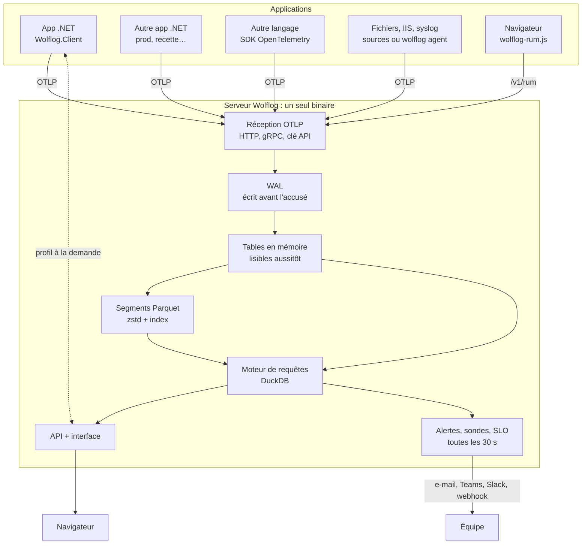

<p align="center"></p>

# Wolflog

Logs, traces, métriques et crashs de vos applications .NET dans un seul serveur, installé en une commande.
Wolflog remplace la combinaison OpenTelemetry Collector + Loki + Tempo + Prometheus + Grafana.

- **Un binaire** : réception OTLP, stockage, requêtes et interface web embarqués. Aucune base de données à installer.
- **Compatible OpenTelemetry** : OTLP/HTTP (protobuf ou JSON) et OTLP/gRPC. N'importe quel langage peut envoyer ses données.
- **Lib .NET** : `builder.AddWolflog();`. Reprend les logs `ILogger` et Serilog, trace ASP.NET Core et HttpClient, collecte les métriques runtime.
- **Crashs** : exceptions non gérées capturées sur disque avant l'arrêt du processus, arrêts brutaux (StackOverflow, kill, recyclage IIS) détectés au redémarrage suivant, avec les derniers logs émis.
- **Tableaux de bord personnalisables** : autant que nécessaire, panneaux au choix (requêtes HTTP, métriques, logs, erreurs, chiffres clés), réorganisables par glisser-déposer.
- **Contenu HTTP** : en-têtes et corps des requêtes reçues et des appels HttpClient, secrets masqués.
- **Plusieurs applications et environnements** dans la même interface (filtres service et environnement).
- **Surveillance** : alertes (taux d'erreur, latence, nouvelle erreur, service muet, requête libre, sondes, SLO, santé de Wolflog)
  envoyées par e-mail, Microsoft Teams, Slack ou webhook, avec un message personnalisable (éditeur visuel, informations de l'alerte, mentions) ;
  sondes de disponibilité HTTP/TCP ; objectifs de service et budget d'erreur.
- **Grafana** : Wolflog comme source de données (plugin Infinity, clé en lecture seule), tableau de bord d'exemple fourni.
- **Au quotidien** : statut des erreurs (à traiter, résolue, ignorée, réapparue, assignée), déploiements marqués sur les graphiques,
  recherches enregistrées, export CSV/JSON, carte des services, variables de tableau de bord, exemplars (d'une métrique à la trace).
- **Au-delà de .NET** : fichiers de logs (texte, JSON, IIS, Docker, Kubernetes), syslog, mode agent, suivi navigateur (erreurs JS, Web Vitals).
- **Audience web anonyme** (à la Umami) : visiteurs, pages, sources et campagnes UTM, pays, appareils, événements et chiffre d'affaires,
  temps réel, entonnoirs ; **cartes de chaleur** des clics et du défilement (à la Microsoft Clarity) avec rage clicks et dead clicks.
  Sans cookie ni IP stockée. Blazor Server : `builder.AddWolflogBlazor();`.
- **Profilage** CPU et mémoire à la demande, en un clic, affiché en graphe en flammes.
- **Comptes et rôles** (lecteur, éditeur, administrateur), clés API par application, **connexion unique** réglée dans l'interface :
  Microsoft 365 (Entra ID), comptes Windows (Active Directory, Kerberos/NTLM), annuaire LDAP / Active Directory (identifiant et mot de
  passe de l'entreprise dans le formulaire), ou tout fournisseur OpenID Connect (Keycloak, Google).
- **Profils d'accès** : à chacun ses parties de Wolflog (un product owner l'audience et les cartes de chaleur, un administrateur système les logs, métriques et alertes), contrôlées par le serveur.
- **Aux couleurs de l'entreprise** : logo, nom et couleur (palette lisible en thème clair comme sombre), page de connexion avec message d'accueil.
- **Interface** : thème clair, sombre ou celui du système, palettes de couleurs, préférences propres à chacun (animations, menu réduit),
  adaptée aux tablettes et aux téléphones.
- **Rapide** : écriture en colonnes (Parquet + zstd), requêtes vectorisées (DuckDB embarqué), segments ignorés sans lecture grâce à des index (plage de temps, services, trigrammes du texte, filtre de Bloom des trace_id).

## Démarrage rapide

Depuis les sources (SDK .NET 10, Node.js 22.22 ou plus récent) :

```bash
cd ui && npm ci && npm run build && cd ..                                      # interface, une seule fois
dotnet run --project src/Wolflog.Server -- --Wolflog:Auth:Enabled=false          # http://localhost:5080
dotnet run --project samples/Wolflog.Demo                                       # optionnel : données de démo
dotnet run --project samples/Wolflog.DemoDirectory                              # optionnel : annuaire LDAP / AD de démo
```

La démo remplit tous les écrans (logs, traces, erreurs, audience, cartes de chaleur) et sert une boutique instrumentée sur
http://localhost:5190/boutique. Avec l'authentification (sans `--Wolflog:Auth:Enabled=false`), le mot de passe administrateur
et la clé API sont générés au premier démarrage (`<data>/secrets.json`) ; passez la clé à la démo avec `-- --Wolflog:ApiKey=wlk_…`.
L'annuaire de démonstration (entreprise fictive Contoso, `ldap://127.0.0.1:10389`) permet d'essayer la connexion avec un identifiant
d'entreprise sans contrôleur de domaine : comptes et réglages dans `samples/Wolflog.DemoDirectory/README.md`.

Brancher une application ensuite :

- **.NET** : `dotnet add package Wolflog.Client`, puis `builder.AddWolflog();` avec `"Wolflog": { "Endpoint": "http://localhost:5080", "ApiKey": "wlk_…" }`.
- **Site web** : créez une clé « navigateur » (Administration > Clés API), puis
  `<script src="http://localhost:5080/wolflog-rum.js" defer data-key="wlb_…" data-service="mon-site"></script>`.
- **Blazor Server** : `dotnet add package Wolflog.Client.Blazor`, `builder.AddWolflogBlazor();`, `app.UseWolflogHeatmapPreview();`
  et `<WolflogAnalytics />` dans `MainLayout.razor`.

Détails ci-dessous. En production, préférez les [archives publiées](#1-installer-le-serveur).

---

## 1. Installer le serveur

Téléchargez l'archive correspondant au serveur depuis les [versions publiées](https://github.com/wolflog-dev/wolflog/releases/latest) : `wolflog-linux-x64.tar.gz`, `wolflog-linux-arm64.tar.gz` ou `wolflog-win-x64.zip`.

### Linux (systemd)

```bash
tar xzf wolflog-linux-x64.tar.gz && cd wolflog-linux-x64
sudo bash install.sh              # options : --port 5080 --data /var/lib/wolflog
```

Le script copie le binaire dans `/opt/wolflog`, crée l'utilisateur système `wolflog` et le service `wolflog.service`, puis affiche l'adresse, le mot de passe administrateur et la clé API.
Relancer le script avec une nouvelle version met à jour l'installation en conservant la configuration et les données.

### Windows : IIS

Prérequis : IIS et le module ASP.NET Core (Hosting Bundle .NET 10). Le script peut installer les deux.

```powershell
Expand-Archive wolflog-win-x64.zip C:\temp\wolflog ; cd C:\temp\wolflog
.\install-iis.ps1                                   # site "Wolflog" sur le port 5080
.\install-iis.ps1 -Port 8080 -HostName wolflog.mondomaine.fr
.\install-iis.ps1 -EnableIis -InstallHostingBundle  # serveur vierge
```

Le pool d'applications est configuré pour Wolflog : toujours démarré, pas d'arrêt pour inactivité, pas de recyclage périodique ni de recyclage avec chevauchement. Les données sont dans `C:\ProgramData\Wolflog`.
Sous IIS, l'OTLP passe par HTTP sur le port du site. Le gRPC (port 4317) n'est disponible qu'en service.

### Windows : service

Copiez le dossier à son emplacement définitif (par exemple `C:\Program Files\Wolflog`), puis dans une console administrateur :

```powershell
.\wolflog.exe install --port 5080 --open-firewall
```

### Docker

```bash
docker run -d --name wolflog -p 5080:5080 -p 4317:4317 -p 4318:4318 -v wolflog-data:/data ghcr.io/wolflog-dev/wolflog
docker logs wolflog        # identifiants générés au premier démarrage
```

Image pour `amd64` et `arm64`. Pour la construire soi-même : `docker build -t wolflog .`

Ou `docker compose -f deploy/docker/docker-compose.yml up -d`.

### Commandes utiles

| Commande | Effet |
|---|---|
| `wolflog credentials` | Affiche l'utilisateur, le mot de passe et la clé API |
| `wolflog install` / `wolflog uninstall` | Installe ou retire le service (les données restent) |
| `wolflog init --data <dir>` | Génère `wolflog.json` sans installer de service |
| `wolflog healthcheck` | Code de sortie 0 si le serveur local répond |
| `wolflog reset-password [user]` | Nouveau mot de passe provisoire (défaut : admin) |
| `wolflog backup <fichier.zip> [--config-only]` | Sauvegarde configuration et données (serveur démarré ou non) |
| `wolflog restore <fichier.zip>` | Restaure une sauvegarde (serveur arrêté) |
| `wolflog agent …` | Lit des fichiers de logs sur une autre machine et les envoie à Wolflog (voir « Autres sources ») |

---

## 2. Connecter une application .NET

```bash
dotnet add package Wolflog.Client
dotnet add package Wolflog.Client.Serilog   # seulement si vous utilisez Serilog
```

`appsettings.json` :

```json
"Wolflog": {
  "Endpoint": "http://wolflog.mondomaine.fr:5080",
  "ApiKey": "la clé affichée à l'installation"
}
```

`Program.cs` :

```csharp
var builder = WebApplication.CreateBuilder(args);
builder.AddWolflog();
```

Cela suffit pour recevoir :

- les logs `ILogger` avec leurs propriétés structurées, les scopes et le `trace_id` ;
- les traces des requêtes entrantes (ASP.NET Core) et sortantes (HttpClient), de Npgsql, MySqlConnector, Azure SDK, MassTransit, et de vos propres `ActivitySource` dont le nom commence comme votre application ;
- les métriques ASP.NET Core, HttpClient et runtime .NET (GC, threads, exceptions), et vos propres `Meter` ;
- les crashs.

### Serilog

Ajoutez `.WriteTo.Wolflog()` à votre configuration existante :

```csharp
builder.AddWolflog();
builder.Services.AddSerilog((services, log) => log
    .ReadFrom.Configuration(builder.Configuration)
    .WriteTo.Console()
    .WriteTo.Wolflog(services));
```

Si vous créez `Log.Logger` avant l'hôte (logger de démarrage), `.WriteTo.Wolflog()` sans argument fonctionne aussi. Les événements émis avant le démarrage sont conservés puis envoyés.

### Options

Toutes les options se règlent dans la section `Wolflog` ou dans `AddWolflog(o => …)` :

| Option | Défaut | Rôle |
|---|---|---|
| `Enabled` | `true` | Désactive tout l'envoi, par exemple en développement |
| `ServiceName` / `ServiceVersion` / `Environment` | nom et version de l'application, `IHostEnvironment` | Identité du service |
| `Logs` / `Traces` / `Metrics` / `Crashes` | `true` | Active chaque type de donnée |
| `TraceSampleRatio` | `1.0` | Échantillonnage des traces |
| `MinimumLevel` | règles `Logging:LogLevel` | Niveau minimum envoyé |
| `ActivitySources` / `Meters` | | Sources supplémentaires, jokers acceptés (`MaSociete.*`) |
| `IgnoredPaths` | `/health`, `/healthz`… | Requêtes non tracées |
| `BufferDirectory` / `MaxBufferSizeMb` | `%TEMP%/wolflog/<service>`, 200 | Tampon disque utilisé quand le serveur est injoignable |
| `ConfigureTracing` / `ConfigureMetrics` | | Accès direct au SDK OpenTelemetry, par exemple `t => t.AddEntityFrameworkCoreInstrumentation()` |

### Fonctionnement côté application

- Les envois sont groupés toutes les 2 s, compressés en gzip et authentifiés par la clé API.
- **Serveur injoignable** : les lots sont écrits dans le tampon disque et renvoyés dans l'ordre dès que le serveur répond. Les files d'attente en mémoire sont bornées : l'application n'est jamais ralentie ni bloquée.
- **Crash** : en cas d'exception non gérée, le rapport est écrit sur disque de façon synchrone avec les 40 derniers logs, puis envoyé immédiatement si possible, sinon au démarrage suivant.
- **Arrêt brutal** : StackOverflow, OutOfMemory, `kill -9` ou recyclage IIS forcé ne laissent aucune chance au code .NET. Wolflog le détecte au démarrage suivant grâce au marqueur de session et le signale comme crash `Wolflog.AbnormalTermination`, avec les derniers logs connus.

### Contenu des requêtes HTTP

Les en-têtes et corps des requêtes reçues (ASP.NET Core) et des appels sortants (HttpClient) sont attachés aux traces
et visibles dans **Requêtes HTTP** et dans le détail d'un span.

```json
"Wolflog": {
  "Http": {
    "Bodies": "Errors",          // Off | Errors (défaut : requêtes en échec uniquement) | All
    "Headers": true,
    "MaxBodyBytes": 16384,
    "RedactedFields": [ "numeroSecu" ],  // ajoutés à la liste par défaut
    "RedactedHeaders": [ "X-Custom-Secret" ]
  }
}
```

Toujours masqués : en-têtes `Authorization`, `Cookie`, `Set-Cookie`, `X-Api-Key`…, et champs JSON ou formulaire
`password`, `token`, `secret`, `apiKey`, `cardNumber`, `cvv`… Les contenus binaires ne sont pas enregistrés (seulement leur type et leur taille).

### Plusieurs applications et environnements

Chaque application est identifiée par son nom (`ServiceName`, par défaut le nom du projet) et son environnement
(`Environment`, par défaut `ASPNETCORE_ENVIRONMENT`). Toutes peuvent envoyer au même serveur : l'interface filtre
par service et par environnement (prod, recette, dev…).

### Profilage à la demande

```
dotnet add package Wolflog.Client.Profiling
```

```csharp
builder.AddWolflog();
builder.AddWolflogProfiling();
```

Page **Profils** : choisir le service, CPU ou mémoire, « Profiler maintenant ». L'application enregistre 15 à 60 s par EventPipe
(le mécanisme de dotnet-trace, sans outil à installer) et le graphe en flammes s'affiche dès réception. Aucun coût hors profil.

### Déploiements

Une nouvelle version d'un service (`service.version`, par défaut la version de l'assembly) est détectée automatiquement et marquée
sur tous les graphiques. Depuis l'intégration continue :

```
curl -X POST http://wolflog:5080/v1/deployments -H "x-wolflog-key: <clé>" -H "content-type: application/json" \
     -d '{"service":"api","env":"prod","version":"1.4.2","description":"Build 481"}'
```

### Autres langages

Tout SDK OpenTelemetry fonctionne. Configurez l'exporteur OTLP vers `http://serveur:5080` (ou `:4318`, ou `:4317` en gRPC) avec l'en-tête `x-wolflog-key: <clé>`.

### Autres sources : fichiers, IIS, Docker, Kubernetes, syslog

Administration > **Sources** : un chemin (`*` accepté) et un format (détection automatique, texte, JSON, IIS W3C, Docker json-file,
Kubernetes/containerd). Un aperçu montre les dernières lignes telles qu'elles seront lues. Les piles d'appels sur plusieurs lignes
deviennent des erreurs regroupées ; les journaux IIS deviennent des requêtes HTTP (page Requêtes HTTP). Syslog : écoute UDP/TCP
(RFC 5424 et 3164) sur le port choisi.

Fichiers situés sur une autre machine : le même binaire, en mode agent.

```
wolflog agent --endpoint https://wolflog:5080 --key <clé> --file "C:\inetpub\logs\LogFiles\W3SVC1\*.log" --format iis --service site
./wolflog agent --config agent.json
```

### Navigateur (RUM)

Créer une clé « navigateur » (Administration > Clés API, en indiquant les sites autorisés), puis dans les pages :

```html
<script src="https://wolflog:5080/wolflog-rum.js" defer data-key="wlb_…" data-service="mon-site" data-env="prod"
        data-trace-origins="https://api.mondomaine.fr"></script>
```

Erreurs JavaScript (regroupées dans Erreurs), chargement des pages, appels fetch/XHR reliés aux traces du serveur par `traceparent`,
Web Vitals (LCP, INP, CLS). Tableau fourni : « Expérience navigateur ». La démo sert une petite boutique instrumentée (`/boutique`, parcourue par des visiteurs simulés)
et un atelier pour déclencher erreurs et appels (`/boutique/atelier`).

Le même script mesure l'**audience** (pages Audience et Clics & défilement) :

- pages vues avec titre, référent (domaine seulement) et paramètres UTM ; les autres paramètres d'URL ne sont jamais conservés ;
- événements : `wolflog.track('inscription', { plan: 'pro' })` ou `<button data-wolflog-event="inscription" data-wolflog-event-plan="pro">` ;
  une propriété `revenue` alimente le chiffre d'affaires ;
- clics (position, sélecteur CSS, libellé des liens et boutons, rage et dead clicks) et défilement maximal, pour les cartes de chaleur.
  Ajoutez `data-wolflog-mask` sur un élément pour ne jamais envoyer son libellé.

Options du script : `data-analytics="false"` (pas d'audience), `data-heatmaps="false"` (ni clics ni défilement),
`data-pageviews="server"` (pages vues mesurées par l'application, voir Blazor ci-dessous).

**Anonymat** : ni cookie ni stockage chez le visiteur pour l'audience, pas d'IP enregistrée. Un visiteur est une empreinte
HMAC-SHA256 (service + IP + navigateur) avec un sel quotidien détruit le lendemain : impossible de suivre quelqu'un d'un jour à l'autre.
Pays : en-tête du CDN (Cloudflare, Vercel, CloudFront) ou région de la langue du navigateur.

### Blazor Server

```bash
dotnet add package Wolflog.Client.Blazor
```

```csharp
builder.AddWolflogBlazor();            // même section "Wolflog" (Endpoint, ApiKey…) que Wolflog.Client
app.UseWolflogHeatmapPreview();         // avant app.UseAntiforgery() : aperçu des cartes de chaleur dans Wolflog
```

```razor
<WolflogAnalytics />                                        @* une fois, dans MainLayout.razor *@
<WolflogErrorBoundary Name="Commande">…</WolflogErrorBoundary>
@inject IWolflogTracker Tracker
await Tracker.TrackAsync("achat", new { revenue = 49.90, plan = "pro" });
```

Événements C# côté serveur (invisibles pour les bloqueurs de publicité), santé des circuits (`blazor-disconnect`, `blazor-reconnect`,
`blazor-circuit-end` avec la durée), exceptions de composants (`blazor-error`, et log d'erreur dans la boîte Erreurs).
Les pages vues peuvent aussi être mesurées côté serveur (`TrackNavigation = true`) : ajoutez alors `data-pageviews="server"` au script navigateur.

---

## 3. Utiliser l'interface

| Page | Contenu |
|---|---|
| Vue d'ensemble | Ce qui demande de l'attention (alertes, sondes, objectifs, santé), volumes, services et dernière version déployée, erreurs à traiter |
| Tableaux de bord | Tableaux personnalisés avec variables (`$route`…) ; fournis : Santé HTTP, Runtime .NET, Expérience navigateur, exemples |
| Logs | Recherche instantanée, histogramme, suivi en direct, détail, recherches enregistrées, export CSV/JSON, « Alerter » |
| Requêtes HTTP | Requêtes reçues ou sortantes, détail avec en-têtes et corps, recherches enregistrées, export, alerte sur le taux d'erreur |
| Traces | Liste filtrable, vue en cascade, logs de chaque span |
| Erreurs | Onglets À traiter / Assignées à moi / Résolues / Ignorées ; résoudre ou ignorer en un clic (touches R et I), sélection multiple, assignation, note, versions touchées |
| Métriques | Toutes les métriques reçues ; traces d'exemple (exemplars) sous le graphique |
| Carte des services | Qui appelle qui (services, bases, API externes), débit, erreurs, p95 ; clic pour les requêtes et traces |
| Profils | Profilage CPU / mémoire à la demande et graphe en flammes |
| Audience | Visiteurs, visites, pages vues, rebond, durée, comparaison avec la période précédente ; pages, entrées/sorties, référents, UTM, navigateurs, appareils, pays, langues, événements et leurs propriétés (clic = filtre) ; temps réel ; entonnoirs |
| Clics & défilement | Carte des clics superposée à la page réelle, carte de défilement (ligne de flottaison, 75/50/25 %), éléments les plus cliqués, rage clicks et dead clicks, par appareil |
| Alertes | En cours, règles, historique, canaux e-mail / Teams / Slack / webhook, message personnalisable. Éditeur de règle pas à pas : condition en phrase avec la valeur actuelle, jauge face au seuil, zone de déclenchement sur le graphique, gravité, canaux avec leur dernier envoi, vérification avant création |
| Disponibilité | Sondes HTTP/TCP : état, disponibilité, temps de réponse, certificat TLS |
| Objectifs (SLO) | Cible, mesure, budget d'erreur restant, vitesse de consommation |
| Administration | Utilisateurs et rôles, profils d'accès (parties visibles par profil), connexion SSO (Microsoft 365, Windows, annuaire LDAP / AD), personnalisation (logo, nom, couleurs), clés API (code d'intégration prêt à coller), sources, santé, stockage, sauvegarde |
| Mon compte | Identité, rôle et profil d'accès, mode de connexion, préférences d'affichage, changement de mot de passe (comptes Wolflog) |

`Ctrl K` ouvre la recherche globale (texte, identifiant de trace, page, tableau, service, métrique, recherche enregistrée).
Les graphiques affichent les déploiements (ligne pointillée, info-bulle). Tout filtre actif est surligné dans la barre du haut.

**Mes préférences** (avatar en haut à droite, ou page Mon compte), propres à chaque navigateur : thème clair, sombre ou celui du
système ; couleurs (Océan, Émeraude, Graphite, Aurore, et celles de l'entreprise si elle en a) ; **Animations** ; lueur qui suit le
pointeur ; menu automatique, réduit ou complet. Par défaut, les animations suivent le réglage du système : si les « Effets
d'animation » de Windows sont désactivés, les navigateurs demandent des animations réduites et l'interface les coupe ;
l'interrupteur permet de les réactiver. Le même menu mène à Mon compte, aux raccourcis clavier et à la déconnexion.

Personnalisation (Administration > Personnalisation) : nom et logo de l'entreprise (menu, titres des onglets, page de
connexion avec « propulsé par Wolflog »), message d'accueil de la page de connexion, et couleur de l'entreprise, dont
Wolflog tire une palette « Entreprise » lisible en thème clair comme sombre : proposée par défaut, ou imposée à tous.
Logo : PNG, JPEG, WebP ou SVG (sans script ni ressource extérieure), 1 Mo au plus ; il fait partie des sauvegardes de la configuration.

**Environnements** (Administration > Environnements) : sans réglage, le sélecteur de la barre du haut propose les valeurs
envoyées par les applications telles quelles (`Environment`, sinon `ASPNETCORE_ENVIRONMENT`). Un environnement configuré en
regroupe plusieurs, sans tenir compte des majuscules (*Production* : `prod`, `Production`, `prd`), avec un libellé, une couleur
(production, recette, développement, autre ou au choix), une place dans le sélecteur, et peut y être masqué. Une application
peut avoir ses propres règles : son `prod` peut être votre préproduction, sans effet sur les autres ; elle peut aussi masquer
des environnements de son sélecteur. « Regrouper automatiquement » propose des regroupements d'après les valeurs reçues sur
30 jours, à revoir avant d'enregistrer. Le filtre s'applique partout (pages, `env:production` dans la recherche, suivi en direct,
alertes, déploiements, API Grafana) ; une valeur non configurée, ou un ancien lien vers elle (`?env=prod`), se filtre toujours
telle quelle. Les réglages (`environments.json`) font partie des sauvegardes de la configuration.

L'interface s'adapte à la largeur de l'écran : sur tablette, le menu se réduit aux icônes (bouton **Réduire le menu**, aussi
disponible sur grand écran) ; sur téléphone, il s'ouvre en tiroir (☰), la barre du haut passe sur deux lignes et les tableaux
gardent leurs colonnes essentielles. Rien ne change de taille au survol : les actions d'un panneau étroit passent dans un menu « ⋯ ».

### Tableaux de bord et requêtes personnalisées

Chaque panneau se construit à partir des données, sans langage de requête à apprendre :

1. **Données** : logs, traces (spans) ou métriques, avec un filtre dans la syntaxe de recherche ci-dessous. Le bouton
   « Ajouter une condition sur… » propose les champs et les valeurs réellement présents dans vos données.
2. **Calcul** : nombre, nombre par seconde, valeurs distinctes, moyenne, somme, min, max, p50, p90, p95, p99 d'un champ numérique
   (durée des spans, attribut numérique comme `cart.items`…).
3. **Regroupement** : n'importe quel champ ou attribut (service, niveau, route, code HTTP, modèle du message, `tenant.id`…).
4. **Affichage** : courbe, barres empilées, classement, tableau ou chiffre, avec un aperçu en direct pendant la configuration.

Depuis les pages Logs, Requêtes HTTP et Métriques, **Ajouter au tableau de bord** transforme la vue affichée en panneau.
En lecture, chaque panneau propose Modifier (enregistré immédiatement), Agrandir et Voir les données. Un clic sur une ligne
d'un classement de logs ouvre les logs correspondants. La période et les filtres sont dans l'URL : un lien copié ouvre la même vue.

### Message des alertes

Le message envoyé se personnalise dans un éditeur visuel (étape 4 d'une règle ; message par défaut de toutes les règles dans
Alertes > Canaux) : gras, italique, liens, listes, mentions, et **informations** insérées en un clic (« + Information » ou `{{`) :

| Information | Exemple | Information | Exemple |
|---|---|---|---|
| `{{statut}}` | Alerte, Résolu | `{{valeur}}` / `{{seuil}}` | 7,2 % / 5 % |
| `{{regle}}` | nom de la règle | `{{fenetre}}` / `{{duree}}` | 5 min / 12 min (à la résolution) |
| `{{message}}` | description générée | `{{requetes}}` / `{{erreurs}}` | 500 / 36 (alertes HTTP) |
| `{{service}}` / `{{env}}` | api-commandes / prod | `{{exception}}` / `{{erreur}}` / `{{occurrences}}` | alertes d'erreur |
| `{{element}}` | service, sonde, groupe… | `{{derniere_erreur}}` | dernier log d'erreur du service |
| `{{lien}}` / `{{consigne}}` / `{{date}}` | | | |

Une ligne dont toutes les informations sont vides n'est pas envoyée (ex. « Consigne : {{consigne}} » sans consigne).

- **Modèles prêts à l'emploi** : Court (l'essentiel en une ligne, idéal sur mobile), Détaillé (service, valeur, seuil, dernière erreur, lien),
  Astreinte, et Erreur applicative pour les alertes d'erreur.
- **Informations** : sous l'éditeur, chacune avec sa valeur actuelle pour la règle ; un clic l'insère dans le titre ou le message, là où
  se trouve le curseur.
- **Aperçu** fidèle, calculé par le serveur avec les données actuelles de la règle : Teams, Slack, e-mail et notification mobile, en thème
  clair ou sombre, au déclenchement (et à chaque rappel), à la résolution (avec sa durée) ou pour un test. Il signale un titre trop long
  pour une notification mobile, un message vide et les informations vides pour cette règle.
- **Envoyer un test** l'envoie pour de vrai aux canaux cochés.

Mentions : adresse e-mail de la personne pour Teams, identifiant membre (`U0123…`) ou `here` pour Slack.

### Grafana

Wolflog sert de source de données à Grafana via le plugin gratuit **Infinity** : requêtes HTTP, logs, erreurs, métriques,
requêtes libres, audience web et alertes en cours, sans rien dupliquer.

1. Administration > Clés API > « Grafana ou un outil de lecture » : clé `wlr_…` en lecture seule (elle ne permet ni d'envoyer
   des données ni d'utiliser l'interface). La page affiche ensuite la configuration à reprendre.
2. Dans Grafana : installer « Infinity », puis ajouter la source (ou `deploy/grafana/datasource.yaml` en provisioning) :
   authentification « API Key », en-tête `x-wolflog-key`, hôte autorisé = l'adresse de Wolflog.
3. Importer `deploy/grafana/wolflog-dashboard.json`, ou créer un panneau : Type JSON, Parser Backend, URL par exemple
   `https://wolflog/api/grafana/http?stat=rate,errors,p95&from=${__from}&to=${__to}`.

| URL (`/api/grafana/…`) | Résultat |
|---|---|
| `http?stat=rate,errors,errorRate,p95&service=&route=&groupBy=service` | série temporelle |
| `query?source=logs&filter=&agg=count&field=&groupBy=&format=timeseries` (ou `table`, `stat`) | requête libre |
| `metrics?name=&groupBy=&stat=` (sans `name` : liste des métriques) | série temporelle |
| `logs?filter=&limit=`, `errors?service=`, `alerts` | tableaux |
| `audience?service=`, `audience/summary`, `audience/breakdown?dimension=page` | audience web |

Séries au format large (`time` puis une colonne par série) ; `env` filtre l'environnement partout.
Ces adresses s'ouvrent aussi avec la session de l'interface, mais seulement pour les comptes qui voient tout : avec un profil
d'accès restreint, elles demandent une clé de lecture (sinon elles contourneraient le profil).

Raccourcis : `?` affiche l'aide, `g` puis une lettre ouvre une page (`g l` logs, `g e` erreurs, `g r` requêtes, `g t` traces,
`g m` métriques, `g d` tableaux de bord, `g u` audience, `g a` alertes…), `/` place le curseur dans la recherche des logs,
`Échap` ferme les panneaux ouverts.

Syntaxe de recherche des logs :

```
timeout                          texte dans le message ou l'exception
"connexion refusée"              phrase exacte
-healthcheck                     exclut un mot
service:api level:warn           service, niveau minimum (trace, debug, info, warn, error, fatal)
host:web-* env:prod version:1.4  colonnes, joker *
http.route:/users/*              n'importe quel attribut
trace:<id>  fingerprint:<id>  crash:true  has:exception
```

---

## 4. Configuration du serveur

Fichiers lus dans cet ordre (le dernier l'emporte) : `appsettings.json`, puis `wolflog.json` à côté du binaire, puis `/etc/wolflog/wolflog.json` (Linux), puis les variables d'environnement (`Wolflog__Retention__LogsDays=30`).

```json
{
  "Wolflog": {
    "DataDirectory": "/var/lib/wolflog",
    "Auth": { "AdminUser": "admin", "AdminPassword": "…", "ApiKeys": [ "…", "…" ] },
    "Storage": { "FlushIntervalSeconds": 60, "FlushRows": 100000, "FsyncWal": false, "MemoryLimit": "2GB" },
    "Retention": { "LogsDays": 14, "TracesDays": 7, "MetricsDays": 30, "AnalyticsDays": 400, "MaxDiskGb": 50 }
  },
  "Kestrel": { "Endpoints": { "Web": { "Url": "https://0.0.0.0:443", "Certificate": { "Path": "cert.pfx", "Password": "…" } } } }
}
```

Les clés API se gèrent dans l'interface (Administration > Clés API : une par application, dernière utilisation, révocation).
Les clés de `wolflog.json` restent acceptées. Sans mot de passe ni clé configurés, le serveur en génère au premier démarrage (`<data>/secrets.json`).

### Comptes, rôles et connexion unique

Rôles : **lecteur** (consulte), **éditeur** (tableaux, alertes, statut des erreurs, sondes, objectifs, profils),
**administrateur** (utilisateurs, clés, sources, sauvegardes). Les comptes se créent dans l'interface avec un mot de passe provisoire.

**Profils d'accès** (Administration > Profils d'accès) : le rôle dit ce qu'une personne peut faire, le profil ce qu'elle voit.
Profils fournis, modifiables : *Tout voir* (développeurs ; profil des comptes sans profil, toujours complet), *Produit* (audience,
clics et défilement, tableaux de bord) et *Exploitation* (vue d'ensemble, logs, métriques, alertes, disponibilité, objectifs) ;
d'autres se créent dans l'interface, chacun avec sa page d'accueil. Le serveur contrôle chaque appel de l'API (403 hors du profil,
changement pris en compte aussitôt) ; les administrateurs voient tout. Un profil attribué ne se supprime pas : réattribuez d'abord ses comptes.

- **Services visibles** : chaque profil peut limiter les applications visibles (liste ou motifs comme `boutique-*`), et une personne peut
  avoir sa propre liste, qui remplace celle de son profil. Les groupes de l'annuaire donnant un profil, un groupe donne aussi ses services.
  Le serveur filtre tout : logs (et suivi en direct), requêtes, traces (seulement les spans des services visibles), erreurs, métriques,
  carte des services (un appel vers un service masqué apparaît comme une dépendance externe), profils, audience, tableaux de bord,
  liste des services et des environnements, déploiements, alertes, sondes et objectifs liés à un service.
- **Tableaux de bord** : un tableau n'est proposé que si au moins un de ses panneaux est accessible ; les panneaux hors du profil sont
  masqués (« 3 panneaux masqués : hors de votre profil d'accès »). Réglage **Visible pour** sur chaque tableau : tout le monde, ou
  certains profils.

**Connexion unique** (Administration > Connexion SSO), sans redémarrage :

- **Microsoft 365 / Entra ID** : locataire, ID d'application et secret client (chiffré sur le serveur, jamais réaffiché), bouton « Tester »
  qui vérifie le locataire, l'application et le secret. La page guide l'inscription dans le portail Azure et donne l'URI de redirection
  à déclarer : `https://wolflog…/signin-oidc`, déduite de l'adresse publique de Wolflog (Alertes > Canaux) si elle est renseignée,
  indispensable derrière un reverse proxy. Microsoft exige HTTPS (sauf `localhost`). Pour les correspondances de groupes, activez la
  revendication « groups » (Configuration des jetons > Ajouter une revendication de groupe > ID de groupe).
- **Windows** (Kerberos ou NTLM, Active Directory) : bouton « Se connecter avec Windows », sans saisie sur un PC du domaine.
  Prérequis : service Windows sur un serveur joint au domaine (alias DNS : `setspn -S HTTP/wolflog.contoso.fr NOMSERVEUR$`), ou IIS avec
  l'authentification Windows du site activée **et** l'authentification anonyme laissée active (`Install-WindowsFeature Web-Windows-Auth`, puis
  Gestionnaire IIS > Authentification, puis recyclage du pool : la commande exacte est dans la page), ou Linux avec un keytab (`KRB5_KTNAME`, paquets `krb5-user` et `gss-ntlmssp` ; les groupes n'y sont pas transmis).
  Connexion silencieuse : adresse de Wolflog dans la zone **Intranet local** (GPO « Liste des attributions de sites aux zones » ; Chrome et Edge :
  `AuthServerAllowlist` ; Firefox : `network.negotiate-auth.trusted-uris`). HTTP/1.1 uniquement, sans reverse proxy. Si le serveur web ne sait
  pas authentifier les sessions Windows, l'activation est refusée avec la marche à suivre.
- **Annuaire LDAP / Active Directory** : la personne saisit dans le formulaire de Wolflog son identifiant de l'entreprise (`jdupont`,
  `jdupont@contoso.fr` ou `CONTOSO\jdupont`) et son mot de passe, vérifiés par l'annuaire. Réglages : serveurs (essayés dans l'ordre), port,
  chiffrement **LDAPS (636, recommandé)**, StartTLS (389) ou aucun (essais seulement), DN de base (lu dans l'annuaire en un clic), filtre et
  attributs préremplis pour Active Directory ou OpenLDAP, groupes imbriqués d'AD (`LDAP_MATCHING_RULE_IN_CHAIN`).
  Le **compte de service** (lecture seule) est facultatif : son mot de passe est chiffré sur le serveur, jamais réaffiché, et n'est envoyé qu'au
  compte et aux serveurs pour lesquels il a été saisi. Sans lui, Active Directory accepte la liaison par UPN : le **suffixe UPN** complète un
  identifiant simple (`jdupont` → `jdupont@contoso.local`). « Tester la connexion » et « Tester un compte » (DN, groupes, rôle et profil prévus,
  sans créer le compte). Un compte Wolflog local passe toujours en premier : `admin` reste l'accès de secours, et l'annuaire ne prend jamais la
  place d'un compte local. Comptes désactivés dans l'annuaire refusés ; mot de passe vide refusé avant tout échange. Rien à installer sous Linux
  ou Docker (client LDAP en .NET) ; pour LDAPS avec une autorité de certification interne, le serveur Wolflog doit l'approuver (magasin Windows,
  ou `update-ca-certificates` sous Linux et dans l'image Docker). Pour essayer sans contrôleur de domaine : annuaire de démonstration
  `samples/Wolflog.DemoDirectory` (comptes et réglages dans son README).
- **Comptes** créés à la première connexion : domaines autorisés (UPN `contoso.fr`, ou domaine Windows `CONTOSO` ; l'annuaire LDAP choisit ses
  comptes par son DN de base et son filtre), rôle et profil d'accès par défaut, groupes de l'annuaire (ID d'objet Entra ID, rôle d'application,
  `DOMAINE\groupe` ou SID, nom ou DN complet d'un groupe LDAP) donnant un rôle et/ou un profil.
  Les rôles suivent l'annuaire : quitter un groupe retire ses droits à la connexion suivante. Un compte désactivé dans Wolflog est refusé.
- **Connexion automatique** (facultative) : la page de connexion part aussitôt vers Microsoft ou Windows ; sur un PC joint à Entra ID,
  Edge connecte la personne avec sa session Windows. Formulaire local toujours accessible : `/login?local=1`.

Les clés de chiffrement des sessions et des secrets sont dans `<data>/data-protection` : les sessions survivent aux redémarrages et aux mises à jour.
Après une restauration sur un autre serveur, ressaisissez le secret client et le mot de passe du compte de service LDAP. La section `Oidc` de `wolflog.json` reste prise en charge
(prioritaire, affichée en lecture seule dans l'interface) :

```json
"Auth": {
  "Oidc": {
    "Authority": "https://login.microsoftonline.com/<tenant>/v2.0",
    "ClientId": "…", "ClientSecret": "…", "DisplayName": "Microsoft",
    "DefaultRole": "viewer", "AdminGroups": [ "<id du groupe>" ], "EditorGroups": [ "<id du groupe>" ]
  }
}
```

### Notifications et sauvegardes

Serveur d'e-mails et adresse publique de Wolflog (pour les liens des notifications) : Alertes > Canaux.
Sauvegarde : Administration > Système (configuration seule, ou avec les données) ou `wolflog backup` dans une tâche planifiée.
La santé de Wolflog (disque, écriture, réception, notifications, date de la dernière sauvegarde) s'affiche dans Système et peut déclencher une alerte.

### HTTPS

Utilisez un reverse proxy (IIS, Nginx, Caddy) ou configurez directement un certificat Kestrel comme dans l'exemple ci-dessus.
Derrière Nginx, désactivez le buffering pour `/api/logs/tail` : `proxy_buffering off;`.

---

## 5. Construire les livrables

Prérequis : SDK .NET 10 et Node.js 22.22 ou plus récent (24 LTS recommandé) pour l'interface Angular.

```powershell
./build/package.ps1             # UI, tests, publications et paquets NuGet dans dist/
./build/package.ps1 -Version 0.2.0 -SkipTests
```

Développement :

```bash
dotnet run --project src/Wolflog.Server          # API sur http://localhost:5080
cd ui && npm start                             # interface sur http://localhost:4200 (proxy vers l'API)
dotnet run --project samples/Wolflog.Demo        # application de démo qui envoie des données
dotnet run --project samples/Wolflog.DemoDirectory   # annuaire LDAP / AD de démonstration (Contoso)
dotnet test --project tests/Wolflog.Tests
```

`Wolflog__Auth__Enabled=false` désactive l'authentification en local.

Conventions du code : un type par fichier (nommé comme le type), espaces de noms « file-scoped », espaces de noms communs dans
le `GlobalUsings.cs` de chaque projet, style défini dans `.editorconfig` et vérifié à la compilation (`using` inutile = avertissement,
bloquant en CI). Les tests `CodeConventionsTests` vérifient la structure des fichiers.
Les tests qui démarrent une application instrumentée dans le processus des tests (ses écouteurs capteraient les requêtes des autres
serveurs de test) sont dans la collection `InstrumentedApps`, exécutée seule, après les autres.
Interface : un composant, pipe ou service par fichier (noms en kebab-case), types de l'API dans `core/models/` par domaine ;
vérifié par `npm run check` (aussi en CI).

Publier une version : `git tag v0.2.0 && git push origin v0.2.0`. GitHub Actions construit les archives, les joint à la version,
publie l'image `ghcr.io/wolflog-dev/wolflog` et les paquets NuGet (Trusted Publishing : aucune clé à stocker).

---

## 6. Architecture


```mermaid
flowchart TB
    subgraph apps[Applications]
        A[App .NET<br/>Wolflog.Client]
        B[Autre app .NET<br/>prod, recette…]
        C[Autre langage<br/>SDK OpenTelemetry]
        F[Fichiers, IIS, syslog<br/>sources ou wolflog agent]
        G[Navigateur<br/>wolflog-rum.js]
    end
    subgraph wolflog[Serveur Wolflog : un seul binaire]
        R[Réception OTLP<br/>HTTP, gRPC, clé API] --> W[WAL<br/>écrit avant l'accusé]
        W --> M[Tables en mémoire<br/>lisibles aussitôt]
        M --> P[Segments Parquet<br/>zstd + index]
        M --> Q[Moteur de requêtes<br/>DuckDB]
        P --> Q
        Q --> UI[API + interface]
        Q --> AL[Alertes, sondes, SLO<br/>toutes les 30 s]
    end
    A & B & C & F -->|OTLP| R
    G -->|/v1/rum| R
    AL -->|e-mail, Teams, Slack, webhook| T[Équipe]
    A <-.->|profil à la demande| UI
    UI --> N[Navigateur]
```

```
Applications ──OTLP (HTTP/gRPC, gzip, clé API)──► Wolflog
                                                  │
     ┌────────────────────────────────────────────┤
     │ 1. WAL : lot écrit sur disque avant l'accusé de réception
     │ 2. Table DuckDB en mémoire : interrogeable immédiatement
     │ 3. Toutes les 60 s ou 100 000 lignes : segment Parquet (zstd, trié par temps)
     │    avec index : min/max temps, services, sévérité max, trigrammes du texte, Bloom des trace_id
     │ 4. Compaction horaire : les segments d'une heure fusionnés en un seul fichier
     │ 5. Rétention par type de donnée et limite de disque
     └──► Requêtes : snapshot immuable → segments élagués par les index → DuckDB (SQL vectorisé)
```

| Projet | Rôle |
|---|---|
| `src/Wolflog.Server` | Serveur : ingestion OTLP, stockage, API, interface embarquée, installeur |
| `src/Wolflog.Client` | Lib .NET (NuGet) : configuration OpenTelemetry, transport avec tampon disque, crashs |
| `src/Wolflog.Client.Serilog` | Sink Serilog |
| `src/Wolflog.Client.Profiling` | Profilage CPU / mémoire à la demande (EventPipe) |
| `src/Wolflog.Protocol` | Messages OTLP générés depuis les `.proto` officiels |
| `ui/` | Interface Angular 22 (signals, zoneless), uPlot, CDK virtual scroll |
| `samples/Wolflog.Demo` | Démonstration (Serilog, trafic, erreurs, crash, page /boutique instrumentée, visiteurs simulés) |
| `samples/Wolflog.DemoDirectory` | Annuaire LDAP de démonstration qui se comporte comme Active Directory (entreprise fictive Contoso) ; utilisé aussi par les tests |
| `tests/Wolflog.Tests` | Tests unitaires, stockage (WAL, compaction, rétention) et bout en bout |

## Licence

MIT. Voir [LICENSE](LICENSE).
